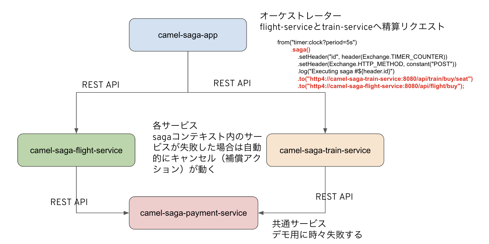
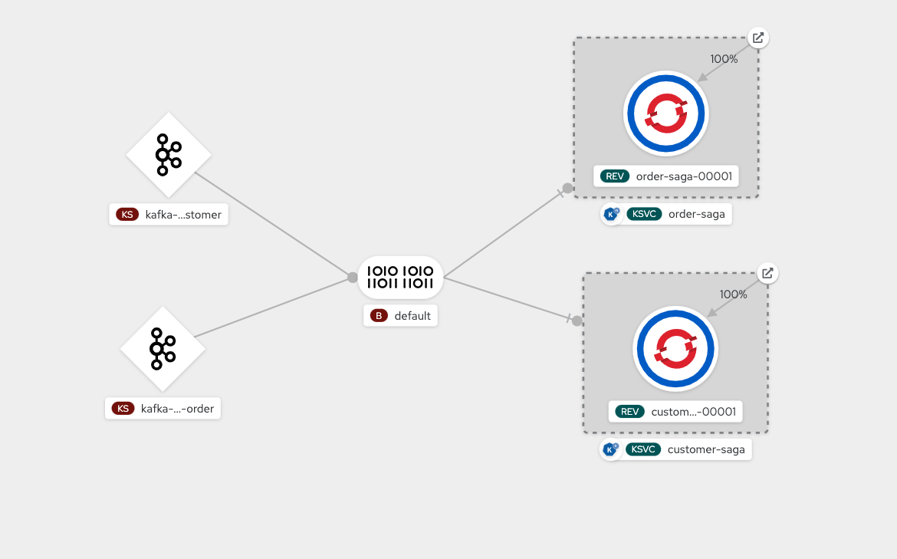

# Camelを使ったSagaパターンDemo on OpenShift

## 動作確認環境

```
$ oc version
Client Version: openshift-clients-4.3.13-202004121622
Server Version: 4.9.22
Kubernetes Version: v1.22.3+b93fd35
```

```
$ mvn -v
Apache Maven 3.6.3 (cecedd343002696d0abb50b32b541b8a6ba2883f)
Maven home: /usr/local/apache-maven-3.6.3
Java version: 11.0.2, vendor: Oracle Corporation, runtime: /Library/Java/JavaVirtualMachines/jdk-11.0.2.jdk/Contents/Home
Default locale: ja_JP, platform encoding: UTF-8
OS name: "mac os x", version: "10.16", arch: "x86_64", family: "mac"
```

```
$ kn version
Version:      v0.26.0
Build Date:   2022-01-18 13:45:52
Git Revision: 67f52529
Supported APIs:
* Serving
  - serving.knative.dev/v1 (knative-serving v0.26.0)
* Eventing
  - sources.knative.dev/v1 (knative-eventing v0.26.0)
  - eventing.knative.dev/v1 (knative-eventing v0.26.0)
```

## Saga - Orchestration Demo

### Orginal Source

- <https://github.com/nicolaferraro/camel-saga-quickstart.git>

### 環境構築手順

```bash
$ oc login 

$ git clone https://github.com/shayashi1225/sample-camel-quarkus.git

$ cd ./sample-camel-quarkus/camel-saga-orchestration

$ oc new-project camel-orchestration

$ oc create -f lra-coordinator.yaml
service/lra-coordinator created
persistentvolumeclaim/lra-coordinator created
imagestream.image.openshift.io/lra-coordinator created
deploymentconfig.apps.openshift.io/lra-coordinator created

$ mvn clean fabric8:deploy -Dfabric8-maven-plugin.version=4.4.1

```

### Demo

デプロイが終わると５秒に一回 _camel-saga-app_ からRESTリクエストされ、一定の確率で _camel-saga-payment-service_ が失敗（Exception）を出す。  
各PODのログと、Camelルートを見ながら解説する。



## Saga - Choreography Demo

### Orginal Source

- <https://github.com/piomin/sample-camel-quarkus>
- <https://piotrminkowski.com/2021/06/14/knative-eventing-with-quarkus-kafka-and-camel/>

### 環境構築手順

1. Kafkaクラスタの構築
    1) "kafka"プロジェクト作成

    ```
    oc new-project kafka
    ```

    2) AMQ Streams Operatorをインストール

    3) Kafkaクラスタ:my-clusterを作成
    >　　　とりあえずデフォルトで。

    ```yaml
    kind: Kafka
    apiVersion: kafka.strimzi.io/v1beta2
    metadata:
    name: my-cluster
    namespace: kafka
    spec:
    kafka:
        version: 3.0.0
        replicas: 3
        listeners:
        - name: plain
            port: 9092
            type: internal
            tls: false
        - name: tls
            port: 9093
            type: internal
            tls: true
        config:
        offsets.topic.replication.factor: 3
        transaction.state.log.replication.factor: 3
        transaction.state.log.min.isr: 2
        log.message.format.version: '3.0'
        inter.broker.protocol.version: '3.0'
        storage:
        type: ephemeral
    zookeeper:
        replicas: 3
        storage:
        type: ephemeral
    entityOperator:
        topicOperator: {}
        userOperator: {}
    ```

    ```bash
    $ oc get pods
    NAME                                         READY   STATUS    RESTARTS   AGE
    my-cluster-entity-operator-9c8b7dc77-j4rbg   3/3     Running   0          3m8s
    my-cluster-kafka-0                           1/1     Running   0          3m44s
    my-cluster-kafka-1                           1/1     Running   0          3m44s
    my-cluster-kafka-2                           1/1     Running   0          3m44s
    my-cluster-zookeeper-0                       1/1     Running   0          4m7s
    my-cluster-zookeeper-1                       1/1     Running   0          4m7s
    my-cluster-zookeeper-2                       1/1     Running   0          4m7s
    ```

    4) kafdropインストール

    ```
    oc project kafka
    ```

    - Developerコンソールの+Addでイメージから作成  
        - イメージ名：obsidiandynamics/kafdrop
    - Deploymentに下記の環境変数を設定
        - KAFKA_BROKERCONNECT my-cluster-kafka-brokers:9092

    - ポートが8080になるので9000に変更

    > 参考

    ```
    docker run -d --rm -p 9000:9000 \
        -e KAFKA_BROKERCONNECT=<host:port,host:port> \
        -e JVM_OPTS="-Xms32M -Xmx64M" \
        -e SERVER_SERVLET_CONTEXTPATH="/" \
        obsidiandynamics/kafdrop

    ```

2. OpenShift Serverlessのインストール
    1) OpenShift Serverless Operatorのインストール
    2) KnativeServingの作成

    ```yaml
    apiVersion: operator.knative.dev/v1alpha1
    kind: KnativeServing
    metadata:
    name: knative-serving
    namespace: knative-serving
    spec: {}
    ```

    3) KnativeEventingの作成

    ```yaml
    kind: KnativeEventing
    apiVersion: operator.knative.dev/v1alpha1
    metadata:
    name: knative-eventing
    namespace: knative-eventing
    spec: {}
    ```

    この時点でknコマンドがOpenShiftのコンソールからダウンロードできるようになる、なければローカルPCへインストールしておく

    4) Knative-kafkaの作成

    ```yaml
    apiVersion: operator.serverless.openshift.io/v1alpha1
    kind: KnativeKafka
    metadata:
    name: knative-kafka
    namespace: knative-eventing
    spec:
    broker:
        defaultConfig:
        authSecretName: ''
        bootstrapServers: 'my-cluster-kafka-bootstrap.kafka:9092'
        numPartitions: 10
        replicationFactor: 3
        enabled: true
    channel:
        authSecretName: ''
        authSecretNamespace: ''
        bootstrapServers: 'my-cluster-kafka-bootstrap.kafka:9092'
        enabled: false
    high-availability:
        replicas: 1
    source:
        enabled: true
    ```

    3. knativeでCamel/Qurkusで書いたマイクロサービスをデプロイ

    1) プロジェクト作成

    ```bash
    $ oc new-project camel-demo
    ```

    2) Kafka Broker作成

    ```bash
    $ cat <<EOF | oc create -f -
    apiVersion: eventing.knative.dev/v1
    kind: Broker
    metadata:
    annotations:
        eventing.knative.dev/broker.class: Kafka
    name: default
    spec:
    config:
        apiVersion: v1
        kind: ConfigMap
        name: kafka-broker-config
        namespace: knative-eventing
    EOF
    ```

    > オリジナルから修正ずみソース

    3) ソース取得

    ```bash
    $ git clone https://github.com/shayashi1225/sample-camel-quarkus.git
    ```

    4) デプロイ

    ```bash
    cd sample-camel-quarkus

    oc create -f saga/customer-saga/k8s/source-2-broker.yaml 
    oc create -f saga/customer-saga/k8s/binding.yaml 
    oc create -f saga/customer-saga/k8s/trigger.yaml 

    oc create -f saga/order-saga/k8s/source-2-broker.yaml 
    oc create -f saga/order-saga/k8s/binding.yaml 
    oc create -f saga/order-saga/k8s/trigger.yaml 

    cd saga/customer-saga
    mvn clean package
    cd saga/order-saga
    mvn clean package
    ```

    ```bash
    $ kn service list
    NAME            URL                                                                                LATEST                AGE     CONDITIONS   READY   REASON
    customer-saga   https://customer-saga-camel-demo.apps.cluster-hmgfs.hmgfs.sandbox127.opentlc.com   customer-saga-00001   2d21h   3 OK / 3     True    
    order-saga      https://order-saga-camel-demo.apps.cluster-hmgfs.hmgfs.sandbox127.opentlc.com      order-saga-00001      27h     3 OK / 3     True   
    ```

### Demo

デプロイが終わると、以下のようになって、オーダーデータが作成されサービス間連携が回り始める。




各サービス（POD）のログとKafdropの表示を見ながら、非同期の連携を見てみる。

